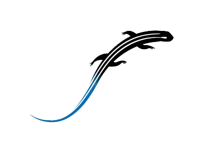

# skink
</img>
(WiP) 
Skink is a small interpreted, object-oriented programming language designed for ease of use and safety with a static type system. It also has some features for numerical analysis and computational science. 

# Why skink?

# Implementation
Skink's core is implemented in Python. The Skink evaluator executes a typed abstract syntax tree. 

